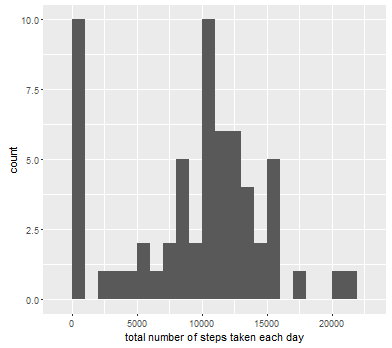
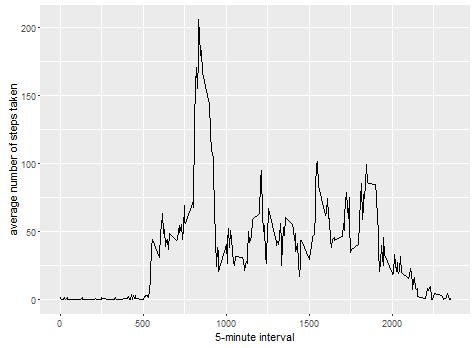
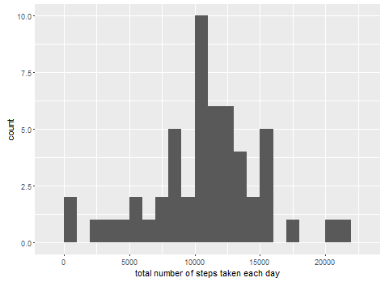
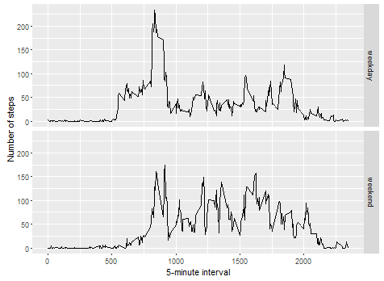

This is an R Markdown document. Markdown is a simple formatting syntax for authoring HTML, PDF, and MS Word documents. For more details on using R Markdown see <http://rmarkdown.rstudio.com>.


## Loading and preprocessing the data
```r
#unzip data file
unzip(zipfile = "activity.zip", exdir=".")
#read file
activityData <- read.csv("activity.csv")
```


## What is mean total number of steps taken per day?
```r
#plot histogram of total number of steps taken each day
#load ggplot2 library
library(ggplot2)
#get total number of steps taken each day
totalStepsEachDay <- tapply(activityData$steps, activityData$date, FUN=sum, na.rm=TRUE)
#plot histogram
qplot(totalStepsEachDay, binwidth=1000, xlab="total number of steps taken each day")
```



```r
#calculate mean and median number of steps taken each day
#mean total number of steps
meanTotalStepsEachDay <- mean(totalStepsEachDay, na.rm=TRUE)
meanTotalStepsEachDay

#Mean Total Steps: 9354.23
```


```r
#median
medianTotalStepsEachDay <- median(totalStepsEachDay, na.rm=TRUE)
medianTotalStepsEachDay
#Median Total Steps: 10395
```


## What is the average daily activity pattern?
```r
#generate a time series plot of the average number of steps taken
#load ggplot2 library
library(ggplot2)


#calculate average number of steps taken each day
averageStepsEachDay <- aggregate(x=list(steps=activityData$steps), by=list(interval=activityData$interval), FUN=mean, na.rm=TRUE)


#plot time series
ggplot(data=averageStepsEachDay, aes(x=interval, y=steps)) + geom_line() + xlab("5-minute interval") + ylab("average number of steps taken")
```




```r
#get the 5 minute interval that on average contains the maximum number of steps
averageMaximumSteps <- averageStepsEachDay[which.max(averageStepsEachDay$steps),]

averageMaximumSteps
#interval    steps
#   835         206.1698
```


## Imputing missing values
```r
#code to describe and show a strategy for imputing missing data
#get missing data
missingData <- is.na(activityData$steps)

#display how many missing data there is
table(missingData)

#show code to replace missing data
replaceDataValue <- function(steps, interval){
    replaced <- NA
    if(!is.na(steps))
        replaced <- c(steps)
    else
        replaced <- (averageStepsEachDay[averageStepsEachDay$interval == interval, "steps"])
    
    return (replaced)
}

replaced.activityData <- activityData
replaced.activityData$steps <- mapply(replaceDataValue, replaced.activityData$steps, replaced.activityData$interval)

```

```r
#plot a histogram of the total number of steps each day after imputing missing values
#get the total number of steps with replaced missing values
totalStepsWithMissingValues <- tapply(replaced.activityData$steps, replaced.activityData$date, FUN=sum)
#plot histogram
qplot(totalStepsWithMissingValues, binwidth=1000, xlab="total number of steps taken each day")
```




## Are there differences in activity patterns between weekdays and weekends?
```r
#panel plot comparing the average number of steps per 5-minute interval over weekdays and weekends
averageStepsWeekdayOrWeekend <- function(date){
    day <- weekdays(date)
    if(day %in% c("Monday", "Tuesday", "Wednesday", "Thursday", "Friday"))
        return("weekday")
    else if(day %in% c("Saturday", "Sunday"))
        return("weekend")
    else
        stop("invalid date")
}

replaced.activityData$date <- as.Date(replaced.activityData$date)
replaced.activityData$day <- sapply(replaced.activityData$date, FUN=averageStepsWeekdayOrWeekend)

#plot
weekdayOrWeekendAverage <- aggregate(steps ~ interval + day, data=replaced.activityData, mean)

ggplot(weekdayOrWeekendAverage, aes(interval, steps)) + geom_line() + facet_grid(day ~ .) + xlab("5-minute interval") + ylab("Number of steps")
```

